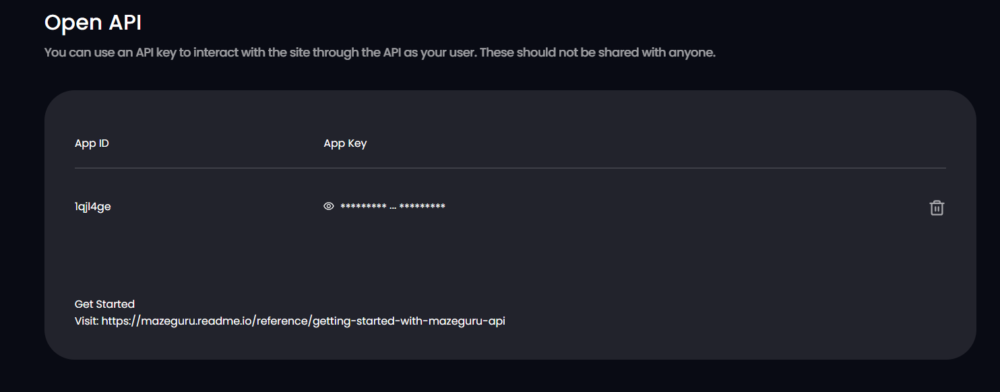

# OpenAPI

Maze.Guru open API

## Install python3 package

`pip3 install -r requirements.txt`

## Command

Usage: api.py [OPTIONS] COMMAND [ARGS]...

### help

`python3 api.py --help`

```
Usage: api.py [OPTIONS] COMMAND [ARGS]...

Options:
  --help  Show this message and exit.

Commands:
  balance
  calc-cost
  cancel
  create-upload-token
  generate-key
  generate-result
  img2img
  set-appid
  sign
  style-base-infos
  style-resource
  txt2img
  upscale
  upscale-result
```

### set-appid

`python3 api.py set-appid --appid=nhdvmv6ixxxx`

Set the appid，and save it in the current directory`appid.txt`

### generate-key

Generate private keys files private_key.txt, save them in the current directory

replace the private key by your web Open API in https://maze.guru/setting



### sign

Signature, no need to call separately, each command will be automatically signed before being called.

If you want to send a separate request by Postman, you need to first call the sign command to generate a signature.

`python3 api.py sign`

### style-base-infos

`python3 api.py style-base-infos`

```
[
    {
      "style_id": 3,
      "style_name": "Default V1",
      "style_type": 3,
      "url": "https://maze-guru.oss-accelerate.aliyuncs.com/resource/an.png"
    },
    {
      "style_id": 29,
      "style_name": "Girl Realistic",
      "style_type": 1,
      "url": "https://maze-guru.oss-accelerate.aliyuncs.com/resource/girl%20realistic.png"
    },
    {
      "style_id": 31,
      "style_name": "Real Photo",
      "style_type": 1,
      "url": "https://maze-guru.oss-accelerate.aliyuncs.com/resource/Real%20Photo.png"
    },
    {
      "style_id": 43,
      "style_name": "Fantasy",
      "style_type": 1,
      "url": "https://maze-guru.oss-accelerate.aliyuncs.com/resource/%E7%BE%8E%E6%BC%AB.jpeg"
    },
    {
      "style_id": 46,
      "style_name": "Semi Impasto",
      "style_type": 3,
      "url": "https://maze-guru.oss-accelerate.aliyuncs.com/resource/%E5%BD%A9%E6%BC%AB.png"
    },
    {
      "style_id": 52,
      "style_name": "Universal",
      "style_type": 1,
      "url": "https://maze-guru.oss-accelerate.aliyuncs.com/resource/Universal.png"
    },
    {
      "style_id": 71,
      "style_name": "Scifi",
      "style_type": 1,
      "url": "https://maze-guru.oss-accelerate.aliyuncs.com/resource/%E7%A7%91%E5%B9%BB.png"
    },
    {
      "style_id": 84,
      "style_name": "TV002",
      "style_type": 3,
      "url": "https://maze-guru.oss-accelerate.aliyuncs.com/resource/TV002.png"
    },
    {
      "style_id": 90,
      "style_name": "C4D",
      "style_type": 1,
      "url": "https://maze-guru.oss-accelerate.aliyuncs.com/resource/1686288874896.png"
    },
    {
      "style_id": 97,
      "style_name": "Everything",
      "style_type": 3,
      "url": "https://maze-guru.oss-accelerate.aliyuncs.com/resource/1688976591219.png"
    },
    {
      "style_id": 100,
      "style_name": "Asian Portrait",
      "style_type": 1,
      "url": "https://maze-guru.oss-accelerate.aliyuncs.com/resource/1688725479319.jpg"
    },
    {
      "style_id": 111,
      "style_name": "Any Portait",
      "style_type": 1,
      "url": "https://maze-guru.oss-accelerate.aliyuncs.com/resource/1690527217408.png"
    },
    {
      "style_id": 112,
      "style_name": "Lineless Art",
      "style_type": 3,
      "url": "https://maze-guru.oss-accelerate.aliyuncs.com/resource/1691734674218.jpg"
    },
    {
      "style_id": 113,
      "style_name": "2.2D Impasto",
      "style_type": 3,
      "url": "https://maze-guru.oss-accelerate.aliyuncs.com/resource/1691735518277.jpg"
    },
    {
      "style_id": 115,
      "style_name": "Emoji Mixed",
      "style_type": 4,
      "url": "https://maze-guru.oss-accelerate.aliyuncs.com/resource/1691738075413.png"
    },
    {
      "style_id": 116,
      "style_name": "SD Figure",
      "style_type": 4,
      "url": "https://maze-guru.oss-accelerate.aliyuncs.com/resource/1691738582653.png"
    },
    {
      "style_id": 117,
      "style_name": "Geometric",
      "style_type": 4,
      "url": "https://maze-guru.oss-accelerate.aliyuncs.com/resource/1691739032626.png"
    },
    {
      "style_id": 118,
      "style_name": "1990s",
      "style_type": 4,
      "url": "https://maze-guru.oss-accelerate.aliyuncs.com/resource/1691739602355.png"
    },
    {
      "style_id": 119,
      "style_name": "Chubby",
      "style_type": 4,
      "url": "https://maze-guru.oss-accelerate.aliyuncs.com/resource/1691739914271.png"
    },
    {
      "style_id": 120,
      "style_name": "Flat Graphics",
      "style_type": 4,
      "url": "https://maze-guru.oss-accelerate.aliyuncs.com/resource/1691740268650.png"
    },
    {
      "style_id": 121,
      "style_name": "Fairy",
      "style_type": 4,
      "url": "https://maze-guru.oss-accelerate.aliyuncs.com/resource/1691740590643.png"
    },
    {
      "style_id": 122,
      "style_name": "Bokeh",
      "style_type": 4,
      "url": "https://maze-guru.oss-accelerate.aliyuncs.com/resource/1691741002979.png"
    },
    {
      "style_id": 123,
      "style_name": "Childbook",
      "style_type": 4,
      "url": "https://maze-guru.oss-accelerate.aliyuncs.com/resource/1691741379928.png"
    },
    {
      "style_id": 124,
      "style_name": "Papercut",
      "style_type": 4,
      "url": "https://maze-guru.oss-accelerate.aliyuncs.com/resource/1691741705797.png"
    },
    {
      "style_id": 125,
      "style_name": "Sharpie",
      "style_type": 4,
      "url": "https://maze-guru.oss-accelerate.aliyuncs.com/resource/1691742136930.png"
    },
    {
      "style_id": 126,
      "style_name": "Tshirt Printing",
      "style_type": 4,
      "url": "https://maze-guru.oss-accelerate.aliyuncs.com/resource/1691743035457.png"
    },
    {
      "style_id": 127,
      "style_name": "Vector Graphics",
      "style_type": 4,
      "url": "https://maze-guru.oss-accelerate.aliyuncs.com/resource/1691743308317.png"
    },
    {
      "style_id": 128,
      "style_name": "Hand Draw",
      "style_type": 4,
      "url": "https://maze-guru.oss-accelerate.aliyuncs.com/resource/1691743980065.png"
    },
    {
      "style_id": 129,
      "style_name": "Minimal Logo",
      "style_type": 4,
      "url": "https://maze-guru.oss-accelerate.aliyuncs.com/resource/1691744479423.jpeg"
    },
    {
      "style_id": 130,
      "style_name": "Watercolor",
      "style_type": 4,
      "url": "https://maze-guru.oss-accelerate.aliyuncs.com/resource/1691744759140.jpeg"
    },
    {
      "style_id": 131,
      "style_name": "Felt Craft",
      "style_type": 4,
      "url": "https://maze-guru.oss-accelerate.aliyuncs.com/resource/1691745115361.png"
    },
    {
      "style_id": 132,
      "style_name": "Hologram",
      "style_type": 4,
      "url": "https://maze-guru.oss-accelerate.aliyuncs.com/resource/1691745549442.png"
    },
    {
      "style_id": 133,
      "style_name": "Vector Design",
      "style_type": 4,
      "url": "https://maze-guru.oss-accelerate.aliyuncs.com/resource/1691745895172.png"
    },
    {
      "style_id": 134,
      "style_name": "Kawayi",
      "style_type": 4,
      "url": "https://maze-guru.oss-accelerate.aliyuncs.com/resource/1691746702596.jpeg"
    },
    {
      "style_id": 140,
      "style_name": "Glass Crack",
      "style_type": 4,
      "url": "https://maze-guru.oss-accelerate.aliyuncs.com/resource/1692326550120.jpeg"
    },
    {
      "style_id": 141,
      "style_name": "Genevieve Book",
      "style_type": 4,
      "url": "https://maze-guru.oss-accelerate.aliyuncs.com/resource/1692326641427.jpeg"
    },
    {
      "style_id": 142,
      "style_name": "Cute Animals",
      "style_type": 4,
      "url": "https://maze-guru.oss-accelerate.aliyuncs.com/resource/1692326781538.jpeg"
    },
    {
      "style_id": 143,
      "style_name": "Cobblestone",
      "style_type": 4,
      "url": "https://maze-guru.oss-accelerate.aliyuncs.com/resource/1692326872643.jpeg"
    },
    {
      "style_id": 144,
      "style_name": "Oriental Ink",
      "style_type": 4,
      "url": "https://maze-guru.oss-accelerate.aliyuncs.com/resource/1692326954301.jpeg"
    },
    {
      "style_id": 145,
      "style_name": "Mexican Sticker",
      "style_type": 4,
      "url": "https://maze-guru.oss-accelerate.aliyuncs.com/resource/1692327023417.jpeg"
    },
    {
      "style_id": 146,
      "style_name": "Zen Illustration",
      "style_type": 4,
      "url": "https://maze-guru.oss-accelerate.aliyuncs.com/resource/1692327103746.jpeg"
    },
    {
      "style_id": 147,
      "style_name": "Japan Minimalist",
      "style_type": 4,
      "url": "https://maze-guru.oss-accelerate.aliyuncs.com/resource/1692327239298.jpeg"
    },
    {
      "style_id": 148,
      "style_name": "2D Chibi",
      "style_type": 4,
      "url": "https://maze-guru.oss-accelerate.aliyuncs.com/resource/1692327322445.jpeg"
    },
    {
      "style_id": 149,
      "style_name": "Star Warframe",
      "style_type": 4,
      "url": "https://maze-guru.oss-accelerate.aliyuncs.com/resource/1692327393469.jpeg"
    },
    {
      "style_id": 150,
      "style_name": "Low Poly",
      "style_type": 4,
      "url": "https://maze-guru.oss-accelerate.aliyuncs.com/resource/1692327490236.jpeg"
    },
    {
      "style_id": 151,
      "style_name": "Splatoon",
      "style_type": 4,
      "url": "https://maze-guru.oss-accelerate.aliyuncs.com/resource/1692327578109.jpeg"
    },
    {
      "style_id": 152,
      "style_name": "Fresh Punk",
      "style_type": 4,
      "url": "https://maze-guru.oss-accelerate.aliyuncs.com/resource/1692327654780.jpeg"
    },
    {
      "style_id": 153,
      "style_name": "MJv5",
      "style_type": 5,
      "url": "https://maze-guru.oss-accelerate.aliyuncs.com/resource/MJv5.2.png"
    },
    {
      "style_id": 154,
      "style_name": "Niji",
      "style_type": 5,
      "url": "https://maze-guru.oss-accelerate.aliyuncs.com/resource/Niji5.png"
    },
    {
      "style_id": 155,
      "style_name": "Anime XL",
      "style_type": 3,
      "url": "https://maze-guru.oss-cn-hongkong.aliyuncs.com/resource/1694141858839.jpeg"
    },
    {
      "style_id": 156,
      "style_name": "2.5D XL",
      "style_type": 1,
      "url": "https://maze-guru.oss-accelerate.aliyuncs.com/resource/1695803665119.jpeg"
    },
    {
      "style_id": 157,
      "style_name": "Ukiyoe",
      "style_type": 4,
      "url": "https://maze-guru.oss-accelerate.aliyuncs.com/resource/1695867674821.png"
    },
    {
      "style_id": 158,
      "style_name": "Yoshitaka Amano",
      "style_type": 4,
      "url": "https://maze-guru.oss-accelerate.aliyuncs.com/resource/1695867762720.png"
    },
    {
      "style_id": 160,
      "style_name": "Goro Fujita",
      "style_type": 4,
      "url": "https://maze-guru.oss-accelerate.aliyuncs.com/resource/1695867834992.png"
    },
    {
      "style_id": 161,
      "style_name": "Kintsugi",
      "style_type": 4,
      "url": "https://maze-guru.oss-accelerate.aliyuncs.com/resource/1695868022489.png"
    },
    {
      "style_id": 162,
      "style_name": "Wabi-sabi",
      "style_type": 4,
      "url": "https://maze-guru.oss-accelerate.aliyuncs.com/resource/1695868110879.png"
    },
    {
      "style_id": 163,
      "style_name": "Ikebana",
      "style_type": 4,
      "url": "https://maze-guru.oss-accelerate.aliyuncs.com/resource/1695868179744.png"
    },
    {
      "style_id": 164,
      "style_name": "Trendy Toys",
      "style_type": 4,
      "url": "https://maze-guru.oss-accelerate.aliyuncs.com/resource/1697704717670.png"
    },
    {
      "style_id": 165,
      "style_name": "Temari",
      "style_type": 4,
      "url": "https://maze-guru.oss-accelerate.aliyuncs.com/resource/1697705145244.png"
    },
    {
      "style_id": 166,
      "style_name": "Surrealism",
      "style_type": 4,
      "url": "https://maze-guru.oss-accelerate.aliyuncs.com/resource/1697766246409.png"
    },
    {
      "style_id": 167,
      "style_name": "Line Art",
      "style_type": 4,
      "url": "https://maze-guru.oss-accelerate.aliyuncs.com/resource/1697770380092.png"
    },
    {
      "style_id": 168,
      "style_name": "Floral Art",
      "style_type": 4,
      "url": "https://maze-guru.oss-accelerate.aliyuncs.com/resource/1697770497147.png"
    },
    {
      "style_id": 169,
      "style_name": "Gothic Fairy Tale",
      "style_type": 4,
      "url": "https://maze-guru.oss-accelerate.aliyuncs.com/resource/1697782022948.png"
    },
    {
      "style_id": 170,
      "style_name": "Superhero Poster",
      "style_type": 4,
      "url": "https://maze-guru.oss-accelerate.aliyuncs.com/resource/1697782113420.png"
    },
    {
      "style_id": 171,
      "style_name": "Superhero Comic",
      "style_type": 4,
      "url": "https://maze-guru.oss-accelerate.aliyuncs.com/resource/1697782163651.png"
    },
    {
      "style_id": 173,
      "style_name": "Superhero Comic III",
      "style_type": 4,
      "url": "https://maze-guru.oss-accelerate.aliyuncs.com/resource/1697782270744.png"
    },
    {
      "style_id": 174,
      "style_name": "Superhero Comic II",
      "style_type": 4,
      "url": "https://maze-guru.oss-accelerate.aliyuncs.com/resource/1697782351706.png"
    },
    {
      "style_id": 175,
      "style_name": "Romantic Goth",
      "style_type": 4,
      "url": "https://maze-guru.oss-accelerate.aliyuncs.com/resource/1697782439634.png"
    },
    {
      "style_id": 176,
      "style_name": "Pop Art",
      "style_type": 4,
      "url": "https://maze-guru.oss-accelerate.aliyuncs.com/resource/1697782558351.png"
    },
    {
      "style_id": 177,
      "style_name": "Kawanabe Kyosai",
      "style_type": 4,
      "url": "https://maze-guru.oss-accelerate.aliyuncs.com/resource/1697782707176.png"
    },
    {
      "style_id": 178,
      "style_name": "Japanese Vintage Poster",
      "style_type": 4,
      "url": "https://maze-guru.oss-accelerate.aliyuncs.com/resource/1697782769265.png"
    },
    {
      "style_id": 179,
      "style_name": "Hina Doll",
      "style_type": 4,
      "url": "https://maze-guru.oss-accelerate.aliyuncs.com/resource/1697782845759.png"
    },
    {
      "style_id": 180,
      "style_name": "Healing Cartoon",
      "style_type": 4,
      "url": "https://maze-guru.oss-accelerate.aliyuncs.com/resource/1697782934254.png"
    },
    {
      "style_id": 181,
      "style_name": "Hasui Kawase",
      "style_type": 4,
      "url": "https://maze-guru.oss-accelerate.aliyuncs.com/resource/1697783022894.png"
    },
    {
      "style_id": 182,
      "style_name": "Harajuku Fashion",
      "style_type": 4,
      "url": "https://maze-guru.oss-accelerate.aliyuncs.com/resource/1697783083791.png"
    },
    {
      "style_id": 183,
      "style_name": "Future Punk",
      "style_type": 4,
      "url": "https://maze-guru.oss-accelerate.aliyuncs.com/resource/1697783158847.png"
    },
    {
      "style_id": 184,
      "style_name": "Cement Design",
      "style_type": 4,
      "url": "https://maze-guru.oss-accelerate.aliyuncs.com/resource/1697783218832.png"
    },
    {
      "style_id": 185,
      "style_name": "Broken Design",
      "style_type": 4,
      "url": "https://maze-guru.oss-accelerate.aliyuncs.com/resource/1697783269557.png"
    },
    {
      "style_id": 186,
      "style_name": "Brazilian Modernism II",
      "style_type": 4,
      "url": "https://maze-guru.oss-accelerate.aliyuncs.com/resource/1697783331022.png"
    },
    {
      "style_id": 187,
      "style_name": "Brazilian Modernism",
      "style_type": 4,
      "url": "https://maze-guru.oss-accelerate.aliyuncs.com/resource/1697783403421.png"
    },
    {
      "style_id": 188,
      "style_name": "Balloon Art",
      "style_type": 4,
      "url": "https://maze-guru.oss-accelerate.aliyuncs.com/resource/1697783467703.png"
    },
    {
      "style_id": 189,
      "style_name": "B&W Goth",
      "style_type": 4,
      "url": "https://maze-guru.oss-accelerate.aliyuncs.com/resource/1697783543719.png"
    },
    {
      "style_id": 192,
      "style_name": "Interior Design XL",
      "style_type": 1,
      "url": "https://maze-guru.oss-accelerate.aliyuncs.com/resource/1699955467961.jpeg"
    },
    {
      "style_id": 193,
      "style_name": "Universal XL",
      "style_type": 1,
      "url": "https://maze-guru.oss-accelerate.aliyuncs.com/resource/1701843949616.jpeg"
    },
    {
      "style_id": 20003,
      "style_name": "MJv6",
      "style_type": 5,
      "url": "https://maze-guru.oss-accelerate.aliyuncs.com/resource/1703152251975.jpg"
    },
    {
      "style_id": 20004,
      "style_name": "Dalle3",
      "style_type": 1,
      "url": "https://maze-guru.oss-accelerate.aliyuncs.com/resource/1701936487188.jpg"
    }
]
```

### style-resource

`python3 api.py style-resource --style_id=84`

### txt2img

`python3 api.py txt2img --style_id=1 --prompt="a beautiful dog" --width=2048 --height=2048`

```
{"jobs": ["25A52E3415A8FC48C12D2ABE29795ABB"]}
```

### img2img

`python3 api.py img2img --style_id=1 --prompt="a beautiful dog" --width=2048 --height=2048 --init_image_url=https://maze-guru.oss-accelerate.aliyuncs.com/ai_init_image/9vjzm9aqg7dnlj547v/dog.png`

```
{"jobs": ["6966C6DC75A4908B041DEC0CACB37BA2"]}
```

### generate-result

Query drawing results (results for txt2img, img2img)

`python3 api.py generate-result --jobs=680A92DF856FE3C39A9D948DF3820605,25A52E3415A8FC48C12D2ABE29795ABB`

```
[
  {
    "job": "680A92DF856FE3C39A9D948DF3820605",
    "status": 4,
    "picture_url": "https://maze-guru.oss-accelerate.aliyuncs.com/ai/nhdvmv6idxx0mth2nb/004829498F51DC51A2C9F361B031FCA9-01.jpg",
    "complete_percent": "1",
    "audio_info": "{\"result\":\"{\\\"code\\\":200,\\\"data_id\\\":\\\"271047016\\\",\\\"msg\\\":\\\"OK\\\",\\\"results\\\":[{\\\"label\\\":\\\"normal\\\",\\\"rate\\\":99.9,\\\"scene\\\":\\\"porn\\\",\\\"suggestion\\\":\\\"pass\\\"},{\\\"label\\\":\\\"normal\\\",\\\"rate\\\":99.88,\\\"scene\\\":\\\"terrorism\\\",\\\"suggestion\\\":\\\"pass\\\"}],\\\"task_id\\\":\\\"img1yjUhgVEbtz5z$5cpaRfpk-1y48dl\\\",\\\"url\\\":\\\"http://aligreen-misc-shanghai.oss-cn-shanghai.aliyuncs.com/outer_upload/1802862059950331/images/3c31f580-f866-11ed-b313-0242ac110006.jpg?Expires=1684738950&OSSAccessKeyId=LTAIFoHlytmLmBNF&Signature=eNSpWTYFt8QcOlLmedtj27xXNX0%3D\\\"}\",\"vendor\":1}"
  },
  {
    "job": "25A52E3415A8FC48C12D2ABE29795ABB",
    "status": 4,
    "picture_url": "https://maze-guru.oss-accelerate.aliyuncs.com/ai/nhdvmv6idxx0mth2nb/99F0A089F174EB56E8FB53D23AD63AA0-01.jpg",
    "complete_percent": "1",
    "audio_info": "{\"result\":\"{\\\"code\\\":200,\\\"data_id\\\":\\\"271049572\\\",\\\"msg\\\":\\\"OK\\\",\\\"results\\\":[{\\\"label\\\":\\\"normal\\\",\\\"rate\\\":99.9,\\\"scene\\\":\\\"porn\\\",\\\"suggestion\\\":\\\"pass\\\"},{\\\"label\\\":\\\"normal\\\",\\\"rate\\\":99.88,\\\"scene\\\":\\\"terrorism\\\",\\\"suggestion\\\":\\\"pass\\\"}],\\\"task_id\\\":\\\"img7Gz6ib7Mk0N4nqEZeoFBW8-1y48pR\\\",\\\"url\\\":\\\"http://aligreen-misc-shanghai.oss-cn-shanghai.aliyuncs.com/outer_upload/1802862059950331/images/24781238-f868-11ed-b079-0242ac110006.jpg?Expires=1684739769&OSSAccessKeyId=LTAIFoHlytmLmBNF&Signature=Glu7McK%2FkLwSPMKMd8Wz6wd82gc%3D\\\"}\",\"vendor\":1}"
  }
]
```

### cancel

Revoke drawing

`python3 api.py cancel --job=6D681141EEAA50CEA5912B26C6D584F1`

### calc-cost

`python3 api.py calc-cost --style_id=1 --prompt="a green eyes dog" --width=2048 --height=2048 --init_image_url=https://maze-guru.oss-accelerate.aliyuncs.com/ai_init_image/9vjzm9aqg7dnlj547v/dog.png`

### create-upload-token

Obtain signature credentials for uploading base images

`python3 api.py create-upload-token --file_name=a.png`

```
https://maze-guru.oss-accelerate.aliyuncs.com/ai_init_image%2Fnhdvmv6idxx0mth2nb%2Fa.png?Expires=1684738309&OSSAccessKeyId=LTAI5tRribuTzznkGdrX9E77&Signature=7FyaGv0xu8qKUC8gRJKzHRCNafU%3D
```

After obtaining the signed URL, use the put request to upload the file, or use the upload command to upload it.

### upload

Upload files by a signed URL

`python3 api.py upload --sign_url=https://maze-guru.oss-accelerate.aliyuncs.com/ai_init_image%2Fnhdvmv6idxx0mth2nb%2Fa.png\?Expires\=1684823948\&OSSAccessKeyId\=LTAI5tRribuTzznkGdrX9E77\&Signature\=QM%2BzBVrGkzXtOxMiNSD2w%2BfmZfk%3D --file=/home/admin/picture/123.png`

### balance

Obtain available points for users

`python3 api.py balance`

### upscale

`python3 api.py upscale --job=6D681141EEAA50CEA5912B26C6D584F1`

### upscale-result

Multiple jobs separated by commas

`python3 api.py upscale-result --jobs=7857EBD3253F87A01637BE11F70C5049`